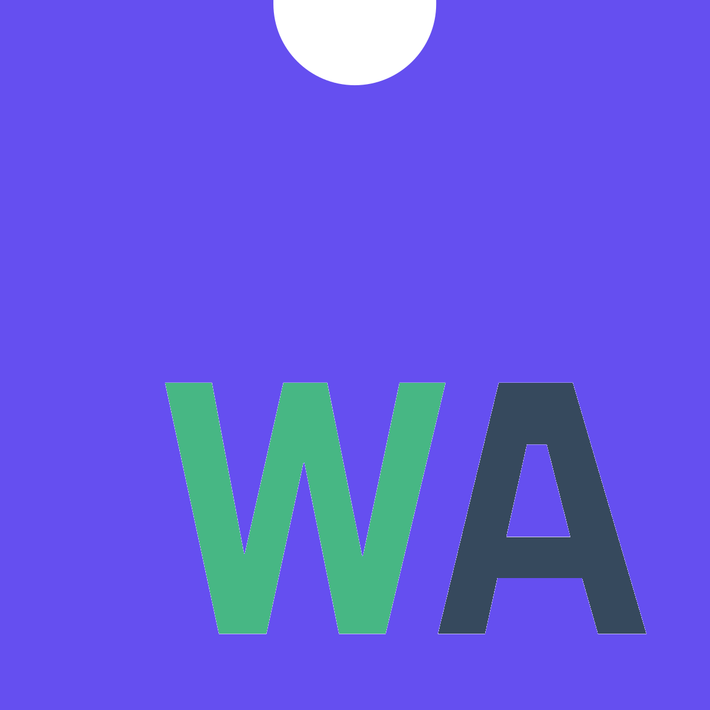

# vue-wasm

> A Vue plugin to help expose your Web Assembly functions in your Vue application



## Install
You can use NPM or Yarn to add this plugin to your project
```bash
npm install vue-wasm
# or
yarn add vue-wasm
```

### Webpack Loader
This package includes a loader to allow you to easily import your `.wasm` files into your webpack project. Just add the following to your webpack config...

```js
// build/webpack.base.conf.js
module: {
  rules: [
    ...
    {
      test: /\.wasm$/,
      loaders: ['wasm-loader']
    }
  ]
}
```
### Basic
Simply import the `vue-wasm` plugin and your Web Assembly modules and then install the plugin whilst passing through an object of `wasm` modules. *The key of the each module will be used to namespace the modules*

```js
import VueWasm from 'vue-wasm';
import addModule from './assets/wasm/add.wasm';

VueWasm(Vue, { modules: { add: addModule } });
```
### Await load
If you need to use your Web Assembly functions in the mounted or created lifecycle hooks, you will need to use a little hack to wait for the plugin to load before initialising your Vue app.

```js
//main.js
import VueWasm from 'vue-wasm';
import add from './assets/wasm/add.wasm';

const init = async () => {
  await VueWasm(Vue, { modules: { add } });
  /* eslint-disable no-new */
  new Vue({
    el: '#app',
    template: '<App/>',
    components: { App },
  });
};

init();
```

## Usage
This will add a `$wasm` object to all of your Vue components. *Note that your functions are nested under the module key that you used whilst installing the plugin.*

```js
// App.vue
mounted() {
  console.log(this.$wasm.add.addOne(2)) // 3
},
```

